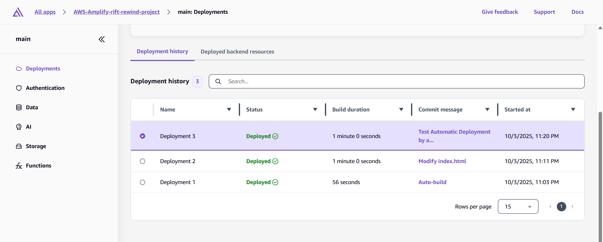

# 🎮 Rift Rewind Developer Challenge

## 👤 Create User & Group
```bash
User Name: Admin
Group Name: Administrators
Group Permissions: Administrator access

Add MFA
```

---

## 🗃️ Create Private S3 Bucket

Switch to (**Admin User**):

```bash
# Bucket Name must be "globally unique"
Bucket Name: rift-rewind-ana-310

Leave all settings as default
```


---

### ⬆️ S3 Upload


> 💡 If you copy the image URL and open it, the browser will show (Access Denied) — because your bucket is private.


#### 🚫 Why this matters:
- Prevents accidental data exposure 🕵️‍♂️
- Protects sensitive information 🔒
- Follows security best practices ✅
- Avoids the "oops, I made my bucket public" mistake that's cost companies millions 💸

---

### 🗂️ Organize S3 Bucket

> 📂 To organize your bucket structure — **create a folder**

> 📤 Move the uploaded image to the **folder**


#### 📁 Why organize?
- Makes finding files easier as your project grows 🧭
- Follows development best practices 🚦
- Helps with permissions and access control later 🛡️
- Keeps things cleaner than your desktop 🧹

---

### 💸 Understanding Costs & Credit Balance

- **Storage:** ~$0.023 per GB per month (US East region)\*
- **Requests:** ~$0.0004 per 1,000 GET requests, $0.005 per 1,000 PUT requests
- **Data transfer:** First 100 GB per month is always free
- Pricing varies by AWS region.

---

## 🌐 Upload Website to S3

**Download Website from** — [here](https://drive.google.com/file/d/19sCNufDD8XUl-UhKkXzNwj4XH7bwsU4t/view?usp=sharing)

**CV.html** — Contains all (**HTML**, **CSS**, **JavaScript**)


When you **copy** the **Object URL** and **paste** it in a new tab, it **appears** as **'Access Denied'**.

**This is important:** Your files are securely stored and not publicly accessible.


---

## 🌍 Create CloudFront (CDN) — Global Distribution

```bash
Create a CloudFront distribution
Distribution name: Rift Rewind Global Distribution
Distribution type: Single website or app
Skip custom domain setup 
Next
Origin type: Amazon S3
S3 origin: Click "Browse S3" and select your bucket 
Origin path: Leave empty
Skip security protections - Choose "Do not enable security protections" 
Next
Create distribution
```


---

### 🏠 Configure Your Default Page

> **Set a default root object** to make your domain automatically serve your main page when users access your root URL


---

### 🟢 CloudFront Output


**What happened behind the scenes:**  
AWS automatically created an Origin Access Control (OAC) and updated your S3 bucket policy.  
Think of OAC like giving your CDN a special VIP pass to your private storage.  
Users can get content through the CDN, but they can't access your storage directly — only CloudFront has the VIP pass. 🛂

---

## 🚀 Deploy Using (GitHub, Amplify)

- Created GitHub account and repository
- Uploaded project files to GitHub
- Deployed project using Amplify + GitHub integration
- Tested automatic deployment by making a code change
- Cleaned up original CloudFront distribution

The CloudFront URL might look ugly now (like `d1234567890123.cloudfront.net`), but later you can connect it to a **custom domain name** to make it look professional. 🌐

### 🏆 What You Will Accomplish

- Store your project code on GitHub 🗃️
- Deploy using AWS Amplify with automatic deployments ⚡
- Clean up your manual CloudFront + S3 setup (to save your Free Tier credits) 🧹

---

### 📦 Create GitHub Repository

> Upload your files to **GitHub** — keep your project versioned and ready for collaboration! 🤝


---

### 🚧 Create AWS Amplify

- **Navigate to Amplify** — In AWS Console
- **Create new app** — Click "**Deploy an app**"
- **Choose source code provider** — Select "**GitHub**" and click "**Next**"
- **Authorize GitHub** — Click "**Authorize AWS Amplify**" and sign in to GitHub if prompted
- **Update GitHub permissions** — Click "**Update GitHub permissions**". You'll be redirected to GitHub to configure AWS Amplify on your GitHub account:
  - Choose "**Only select repositories**"
  - **Select repository**
  - Click "**Install & Authorize**"
- **Select repository** in AWS Amplify
- branch: **main**
- Next
- **App name**: AWS-Amplify-rift-rewind-project
- Next
- **Save and Deploy**

---

### ✅ Verify Initial Deployment

**Copy the Amplify domain** (like https://main.ddrcpyox7wwsr.amplifyapp.com/)


---

### 🔄⚡ Test Automatic Deployments

> Edit **index.html** — Add pencil icon (✏️) to indicate edit



#### 🚀 Output


You now have a professional development setup that automatically deploys your changes and showcases your work. Here's what you've accomplished
-  Professional code storage on GitHub with full version history
- Automated deployment pipeline that updates your live project instantly
- Global CDN performance without manual configuration
- Portfolio-ready project that demonstrates modern development practices

<br>
<br>

## Building Your First Riot Games API Integration

### 🔑 Get Your Riot Developer API Key

Register for [Riot Developer Portal](https://developer.riotgames.com/)

- **Sign in with your Riot Account** - Use your existing Riot Games account (or create one)
- **Accept Developer Terms** - Read and accept the Riot Games API Terms of Service
- **Get your API key:**
  - Navigate to your **dashboard**
  - You'll see "**Development API Key**" with a "**REGENERATE API KEY**" button
  - **Copy this key** and save it securely (it expires every 24 hours for personal keys)

### Configure Secure API Key Storage

- Navigate to **Systems Manager** - In the AWS Console
- In the **left sidebar**, click "**Parameter Store**"
- Click "**Create parameter**"
- **Description**: "Riot Games API key for League data integration"
- **Tier:** Standard
- **Type:** SecureString (this encrypts your API key)
- **Value:** Paste your **Riot API key** here
- **Create parameter**

<!-- imag -->

##### Create Permissions Policy


